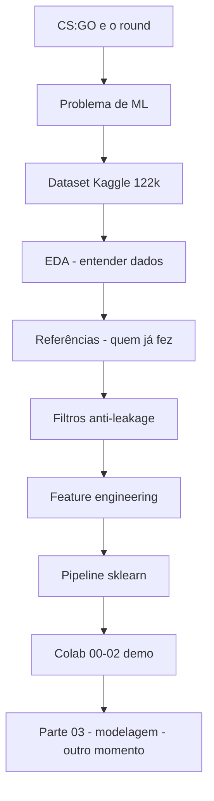

# Guia de estudo — Pedro (Apresentação Parte I + II + Colab)

> **Sua missão:** slides **1–12** do PPTX + demo no Colab **Partes 00, 01 e 02** (sem modelagem).  
> **Tempo sugerido:** 8–10 minutos de fala + 3–4 minutos no Colab.  
> **Slides:** `Docs/Apresentacao-CSGO-ML (2).pptx`

---

## Como usar este guia

1. Leia **uma fase por dia** (plano no final).
2. Para cada slide: leia **O que é** → **O que falar** → **Números para decorar**.
3. Abra o Colab e role junto com a **Fase 6** — não decore código, entenda o *porquê*.
4. Use `O-que-falar.md` como cola no dia da apresentação.

**Frase-guia do projeto:**

> *“Usamos o estado do round no **início** — economia, armas, mapa — para estimar quem tem mais chance de vencer. Não prevemos o futuro do jogo; preparamos dados limpos para o modelo aprender padrões.”*

---

## Mapa mental (guarde isso)



---

# FASE 0 — Glossário rápido (15 min)

### CS:GO

| Termo | Significado simples |
|-------|---------------------|
| **Round** | Uma “rodada” da partida (~115 s). Unidade que analisamos. |
| **CT** | Time que **defende** / desarma bomba. |
| **T** | Time que **ataca** / planta bomba. |
| **Economia** | Dinheiro virtual ($) para comprar armas no próximo round. |
| **AWP** | Sniper forte — muda muito a tática. |
| **Buy tier** | Fase de compra: eco, force, half, full… |
| **Snapshot** | “Foto” do estado do round em um instante (a cada ~20 s). |

### Machine Learning (só o que você precisa)

| Termo | Significado simples |
|-------|---------------------|
| **Classificação binária** | Prever uma de **duas** classes: CT ou T vence. |
| **Regressão** | Prever um **número** contínuo (ex.: diferença de $). |
| **Feature** | Coluna de entrada do modelo (economia, mapa, armas…). |
| **Target / alvo** | O que queremos prever (`round_winner`, `money_diff`). |
| **EDA** | Explorar dados antes de modelar — gráficos, contagens, correlações. |
| **Leakage** | Usar informação do “futuro” sem perceber → modelo inflado. |
| **Pipeline** | Sequência automática: escalar, codificar, treinar. |

### Python / pandas (sintaxe que aparece no Colab)

| Código | O que faz | Analogia |
|--------|-----------|----------|
| `df["x"] = a - b` | Nova coluna | Planilha Excel: coluna calculada |
| `.astype(int)` | Vira 0 ou 1 | CT/T → números para o computador |
| `.mean()` | Média | Se der 0,605 → 60,5% |
| `.value_counts()` | Conta categorias | Quantos CT vs T |
| `.loc[mask]` | Filtra linhas | Filtro na planilha |
| `mask &= cond` | E lógico | Só passa quem cumpre **todas** as regras |
| `.map(função)` | Aplica regra em cada valor | Classificar cada time em buy tier |
| `.sum(axis=1)` | Soma por linha | Total de rifles do time naquela linha |
| `fit_transform` | Aprende + transforma (treino) | Calibrar régua só com dados de treino |
| `transform` | Só aplica (teste) | Usar a mesma régua no teste |

---

# FASE 1 — CS:GO e contexto (Slides 1, 3, 4)

## Slide 1 — Capa (30 s)

**O que falar:**

> “Boa tarde. Somos Pedro, Carlos e Karine. O trabalho prevê o vencedor de rounds em CS:GO com Machine Learning clássico, usando economia e armamento. Tudo está no GitHub e roda no Google Colab com um clique.”

Aponte: repositório + `COLAB_PROJETO-COMPLETO.ipynb`.

---

## Slide 2 — Sumário (20 s)

**O que falar:**

> “Dividimos em três partes: eu cubro o **problema**, a **exploração dos dados** e o **pré-processamento**. Depois mostramos a modelagem e os resultados.”

---

## Slide 3 — Parte I (5 s)

Só introdução visual. Pode dizer: *“Começamos pelo contexto do jogo e pelos dados.”*

---

## Slide 4 — CS:GO e o round (1 min)

### Aprenda o jogo em 4 frases

1. São **5 jogadores CT** vs **5 jogadores T**.
2. Cada **round** é uma disputa separada.
3. Vence quem elimina o adversário, cumpre o objetivo da bomba ou ganha no tempo.
4. O **dinheiro** do round anterior define o **armamento** do próximo.

### Por que isso vira problema de dados?

| No jogo | No dataset |
|---------|------------|
| Um round | Uma ou mais **linhas** (snapshots) |
| Quem ganhou | Coluna `round_winner` (CT ou T) |
| Dinheiro / armas | `ct_money`, `t_money`, `ct_weapon_*`, etc. |

**O que falar:**

> “Nossa unidade de análise é o **round**, mas o dataset registra vários **snapshots** ao longo dele. No início do round, cada time tem economia e loadout — hoje isso é lido na **intuição** do jogador. Queremos **quantificar** essa vantagem.”

---

# FASE 2 — Problema de ML e dataset (Slides 5, 6)

## Slide 5 — Formulação matemática (45 s)

### Tarefa 1 — Classificação (principal)

- **Entrada (X):** economia, armas, mapa, jogadores vivos…
- **Saída (y):** `target_cls` → **0** se CT vence, **1** se T vence

### Tarefa 2 — Regressão (complementar)

- **Alvo:** `money_diff = ct_money − t_money` (número em dólares)

**O que falar:**

> “A pergunta principal é: **quem vence o round?** Isso é classificação binária. Como complemento, também estimamos a **diferença de dinheiro** entre os times — regressão.”

*Não entre em detalhes dos modelos (LR, RF…) — isso é Parte III.*

---

## Slide 6 — Hipótese e dataset (1 min)

### Números para decorar

| Dado | Valor |
|------|-------|
| Linhas | **122.410** |
| Colunas | **97** |
| Nulos | **0** |
| Heurística “time com mais $ vence” | **60,5%** |
| Balanceamento | **51% T / 49% CT** |
| Origem | Skybox AI Challenge (~700 demos, 2019–2020) |
| Fonte | Kaggle — Christian Lillelund |

### Por que ML?

Regra simples erra **~40%** das vezes. ML junta **dezenas de variáveis** (mapa, AWP, granadas, buy tier) e relações **não lineares**.

**O que falar:**

> “A regra ‘quem tem mais dinheiro ganha’ acerta só **60,5%** dos casos. O dataset tem **122 mil snapshots**, **97 colunas**, sem nulos, vindos de partidas profissionais publicadas no Kaggle após o desafio Skybox.”

---

# FASE 3 — EDA (Slide 7) — 1 min 30

## O que é EDA?

**Exploratory Data Analysis** = abrir o dataset e **perguntar** antes de treinar modelo:

1. Está limpo? (nulos, outliers)
2. Classes balanceadas?
3. O que correlaciona com vitória?
4. Tem armadilha metodológica?

## Achados do slide 7

| Achado | Significado | Como explicar |
|--------|-------------|---------------|
| 51% / 49% | Classes equilibradas | “Accuracy e F1 fazem sentido sem desbalanceamento extremo.” |
| Economia | `money_diff` ajuda, mas não decide sozinho | “Liga com os 60,5%.” |
| Mapa, AWP, bomba | Fatores táticos extras | “ML usa tudo junto.” |
| Outliers ~8% | `money_diff` com cauda longa (IQR) | “Mantivemos — rounds muito desiguais são informação real.” |
| **Leakage** | Vários snapshots por round | Ver abaixo — **conceito mais importante** |

### Leakage — entenda de vez

**Problema:** o mesmo round aparece **várias vezes** (a cada ~20 s). No **fim** do round:
- `time_left` baixo
- jogadores mortos
- bomba plantada  

→ o snapshot **já “entrega”** quem vai ganhar.

**Solução do projeto:** usar só o **início** do round → `time_left >= 150`.

**Analogia:** é como prever o resultado de uma prova **depois** de ver a folha de respostas preenchida.

**O que falar:**

> “Na EDA vimos classes equilibradas, economia relevante mas insuficiente sozinha, e impacto de mapa, AWP e bomba. O ponto crítico é o **leakage**: snapshots do fim do round vazam o resultado. Por isso, no pré-processamento, ficamos só com o **início** do round.”

### Gráficos (se mostrar no Colab ou PPT)

| Arquivo | Uma frase |
|---------|-----------|
| `01_distribuicao_vencedor.png` | “CT e T bem equilibrados.” |
| `02_economia.png` | “Dinheiro CT vs T e diferença por vencedor.” |
| `04_buy_tier.png` | “Fase de compra muda a chance de vitória.” |
| `06_awp_impacto.png` | “Ter AWP altera a probabilidade.” |
| `09_correlacao.png` | “Quais variáveis andam juntas.” |

---

# FASE 4 — Referências (Slide 8) — 1 min

## Quem é quem (4 nomes + posicionamento)

```
Skybox (2020)     → gravou as partidas pro / desafio de IA
Lillelund/Kaggle  → publicou o CSV que usamos
Hiemstra          → Bayes no mesmo dataset (outro método)
Ghosh / CSGOPredictor → LR e RF no GitHub (inspiração)
```

| Trabalho | O que fez | Relação com **nós** |
|----------|-----------|---------------------|
| **Skybox AI Challenge** | Competição; ~700 demos | **Origem** dos dados |
| **Lillelund (Kaggle)** | CSV 122k × 97 | **Dataset que baixamos** |
| **Hiemstra** | Probabilidade Bayesiana | Mesmo problema, método diferente |
| **Ghosh / CSGOPredictor** | LR, RF (GitHub) | Baselines parecidos; nós ampliamos com SVM, KNN, regressão |

**O que falar:**

> “Não inventamos o problema. Os dados vêm do **Skybox**, publicados no **Kaggle** pelo Lillelund. O Hiemstra já estimou vitória com **Bayes** no mesmo CSV. Repositórios no GitHub usam **Regressão Logística e Random Forest**. Nossa entrega é um **pipeline reproduzível no Colab**, com EDA de leakage, feature engineering e comparação sistemática de modelos clássicos.”

Detalhes extras: `Docs/slides/referencias-e-trabalhos-relacionados.md`

---

# FASE 5 — Pré-processamento (Slides 9–12) — ~3 min

## Slide 9 — Parte II (5 s)

> “Agora mostro **como transformamos** o bruto em entrada para os modelos.”

---

## Slide 10 — Limpeza / filtros (1 min)

| Filtro | Regra | Motivo |
|--------|-------|--------|
| Início do round | `time_left >= 150` | Anti-**leakage** |
| Times completos | 5 CT e 5 T vivos | Snapshot 5v5 |
| Mapa | excluir `de_cache` | Poucos dados |
| **Resultado** | **122.410 → 33.365** | ~27% das linhas |

**O que falar:**

> “Aplicamos três filtros: só início do round, só 5 contra 5, e removemos um mapa raro. De **122 mil** linhas ficamos com **33 mil** — dados mais limpos e sem vazar o desfecho.”

### Código no Colab (entenda, não decore)

```python
mask = df["time_left"] >= 150
mask &= df["ct_players_alive"] == 5
mask &= df["t_players_alive"] == 5
mask &= ~df["map"].isin(MAP_EXCLUDE)
df = df.loc[mask].copy()
```

- `&=` → “e também tem que ser verdade”
- `~` → negação (“**não** está nesta lista”)

---

## Slide 11 — Feature engineering (1 min)

**Feature engineering** = criar colunas novas que resumem a vantagem.

| Grupo | Features | Ideia |
|-------|----------|-------|
| Econômicas | `money_diff`, `money_ratio` | CT − T em $ e proporção |
| Estado | `health_diff`, `armor_diff`, `players_alive_diff` | Vantagem corrente CT − T |
| Armamento | `ct_rifle_count`, `ct_has_awp` | Poder de fogo |
| Buy tier | `ct_buy_tier`, `t_buy_tier` | Eco / force / half / full / mixed |

### Buy tier — explique assim

Dinheiro total do time ÷ **5 jogadores** = média por jogador → categoria:

| Tier | $ médio / jogador | Em português |
|------|-------------------|--------------|
| **force** | &lt; 1.700 | compra barata forçada |
| **eco** | &lt; 2.000 | economizando |
| **half** | 2.800 – 3.799 | meia compra |
| **full** | ≥ 4.700 | compra cheia |
| **mixed** | entre faixas | transição |

**O que falar:**

> “Além das colunas originais, criamos diferenças CT menos T, contagem de rifles, flag de AWP e **buy tier** — a fase de compra de cada time.”

---

## Slide 12 — Pipeline sklearn (45 s)

### Fluxo (decore esta sequência)

```
122.410 brutos → filtros → 33.365 → features → ColumnTransformer → split 80/20 → (modelo na Parte III)
```

| Peça | Função | Por quê |
|------|--------|---------|
| **StandardScaler** | z = (x − μ) / σ | KNN e SVM usam **distância** — escalas diferentes distorcem |
| **OneHotEncoder** | mapa e buy tier viram 0/1 | Categoria sem ordem falsa (Inferno não é “maior” que Dust2) |
| **train_test_split 80/20** | 80% treino, 20% teste | Avaliar em dados **nunca vistos** |
| **stratify** | mantém % CT/T | Classes balanceadas no split |
| **GridSearchCV** | busca hiperparâmetros | Citado no slide; detalhes na Parte III |

**Regra de ouro:** `fit` só no **treino**; `transform` no teste (não “vazar” o teste para dentro do treino).

**O que falar:**

> “Montamos um **ColumnTransformer**: números passam pelo **StandardScaler**, categorias pelo **OneHotEncoder**. Separamos **80% treino e 20% teste** com estratificação. Com isso, os dados estão prontos para a modelagem.”

---

# FASE 6 — Demo no Colab (Partes 00, 01, 02)

**Abrir:** [COLAB_PROJETO-COMPLETO.ipynb](https://colab.research.google.com/github/carloseduardob/projeto-machine-learning-csgo/blob/main/notebooks/COLAB_PROJETO-COMPLETO.ipynb)

**Dica:** rode **antes** da apresentação para ter células com output. No dia, **role e comente** — não execute tudo do zero (demora).

---

## PARTE 00 — Setup (~1 min) — só citar

**O que acontece:**
1. Clona o repositório (se necessário)
2. `pip install -r requirements-colab.txt`
3. `kagglehub.dataset_download(...)` — baixa o CSV **sem** conta Kaggle
4. `pd.read_csv` → mostra `shape`, nulos, `head()`

**O que falar:**

> “A Parte 00 instala dependências e baixa automaticamente o dataset do Kaggle. São **122.410 linhas**, **97 colunas**, **zero nulos**.”

```python
df = pd.read_csv(CSV_PATH)
print(df.shape)          # (122410, 97)
print(df.isna().sum().sum())  # 0
```

---

## PARTE 01 — EDA (~3 min) — mostre com calma

### Passo 1 — Carregar e criar colunas na EDA

```python
df["money_diff"] = df["ct_money"] - df["t_money"]
df["target"] = (df["round_winner"] == "T").astype(int)
df["richer_wins"].mean()   # ~0.605 → 60,5%
```

**Diga:** “Aqui calculamos a diferença de economia e a heurística ‘time mais rico vence’ — **60,5%**.”

### Passo 2 — Gráficos (escolha 2–3)

Role pelas células que salvam `01_`, `02_`, `04_`, `07_`, `09_`. Para cada um, **uma frase** (tabela na Fase 3).

### Passo 3 — Outliers (seção 01.8b)

```python
outlier_stats = {col: iqr_outliers(df[col]) for col in outlier_cols}
```

**Diga:** “Quantificamos outliers na economia — cerca de **8%** em `money_diff`. Mantivemos porque rounds muito desbalanceados são táticos.”

### Passo 4 — Leakage (markdown após correlações)

**Diga:** “Documentamos o leakage: vários snapshots por round. Na Parte 02 aplicamos `time_left >= 150`.”

---

## PARTE 02 — Pré-processamento (~3 min)

### Passo 1 — Filtros + features

```python
df_raw = pd.read_csv(CSV_PATH)
df = add_derived_features(filter_round_start(df_raw))
print("Bruto:", df_raw.shape)
print("Após filtros:", df.shape)   # ~33365
```

**Diga:** “Mesma lógica dos slides: de **122 mil** para **33 mil** linhas.”

### Passo 2 — `target_cls` e buy tier

```python
"target_cls": (out["round_winner"] == "T").astype(int)
"ct_buy_tier": out["ct_money"].map(buy_tier)
```

**Diga:** “Criamos o alvo numérico e categorias de compra.”

### Passo 3 — Split e pipeline

```python
X_train, X_test, y_train, y_test = train_test_split(
    X_cls, y_cls, test_size=0.2, random_state=42, stratify=y_cls
)
preprocessor = make_preprocessor(df)
X_train_t = preprocessor.fit_transform(X_train)
X_test_t = preprocessor.transform(X_test)
```

**Diga:** “Separamos treino e teste, montamos o `ColumnTransformer` e transformamos as features. Reparem: **fit** no treino, **transform** no teste.”

### Onde parar

**Não role a Parte 03.** Feche assim:

> “Até aqui: dados baixados, explorados, filtrados e transformados. Na **Parte III** mostramos o treinamento dos modelos e os resultados.”

---

# Roteiro cronometrado — slides + Colab

| Etapa | Tempo | Conteúdo |
|-------|-------|----------|
| Slide 1 | 0:30 | Capa, GitHub, Colab |
| Slide 2–3 | 0:25 | Sumário, Parte I |
| Slide 4 | 1:00 | CS:GO, round, economia |
| Slide 5 | 0:45 | Classificação + regressão |
| Slide 6 | 1:00 | 60,5%, dataset, Kaggle |
| Slide 7 | 1:30 | EDA, leakage, outliers |
| Slide 8 | 1:00 | Referências |
| Slide 9–12 | 2:30 | Filtros, features, pipeline |
| **Colab 00–02** | 3:30 | Demo comentada |
| **Total** | **~12 min** | Ajuste cortando gráficos se precisar |

---

# Perguntas do professor — respostas prontas

| Pergunta | Resposta |
|----------|----------|
| O que é CS:GO no projeto? | Jogo 5v5; cada **round** é uma disputa; analisamos snapshots do estado do round. |
| Por que ML? | Regra “mais $” só acerta **60,5%**; muitas variáveis e relações não lineares. |
| O que é leakage? | Snapshot do **fim** do round revela o resultado; filtramos **início** (`time_left >= 150`). |
| Por que 122k → 33k? | Filtros de qualidade + anti-leakage + mapa raro. |
| Por que StandardScaler? | KNN/SVM usam distância; colunas em escalas diferentes distorcem. |
| Por que OneHot no mapa? | Mapa é **categoria**, não número ordenado. |
| De onde veio o dataset? | **Skybox** → **Lillelund/Kaggle**. |
| O que vocês fizeram de novo? | Pipeline Colab reproduzível, EDA de leakage, features (buy tier), comparação de modelos. |
| Qual o alvo? | Classificação: `target_cls` (T=1). Regressão: `money_diff`. |

---

# Auto-teste (responda sem olhar)

1. Quantas linhas tem o dataset bruto? E após filtros?
2. O que significa `target_cls = 1`?
3. Explique leakage em uma frase.
4. Cite dois trabalhos relacionados e a diferença para o nosso.
5. O que faz o `StandardScaler`?
6. Por que `fit_transform` só no treino?

**Gabarito:** (1) 122.410 → 33.365 (2) T venceu (3) snapshot do fim vaza o resultado (4) ex.: Hiemstra=Bayes, nós=ML clássico (5) padroniza escala (6) não vazar estatísticas do teste.

---

# Plano de estudo — 3 dias

### Dia 1 — Jogo + problema (1h)
- [ ] Ler Fases 0–2 deste guia
- [ ] Ver 5 min de CS:GO no YouTube (round + economia)
- [ ] Decorar: **122.410**, **33.365**, **60,5%**, **51/49**

### Dia 2 — EDA + referências (1h)
- [ ] Ler Fases 3–4
- [ ] Explicar leakage em voz alta para alguém (ou no espelho)
- [ ] Ler `Docs/slides/referencias-e-trabalhos-relacionados.md`

### Dia 3 — Pré-processamento + Colab (1h30)
- [ ] Ler Fases 5–6
- [ ] Abrir Colab, rolar Partes 00–02 com este guia ao lado
- [ ] Ensaio completo: slides 1–12 → Colab → frase de encerramento

---

# Frase de encerramento (memorize)

> “Resumindo: partimos de partidas profissionais de CS:GO, exploramos os dados e tratamos o **leakage**, criamos **features táticas** e montamos o **pipeline** no scikit-learn. Com os dados prontos, na Parte III apresentamos os **modelos** e os **resultados**.”

---

*Última atualização: alinhado ao PPTX `Apresentacao-CSGO-ML (2).pptx` e métricas de `reports/metrics/model_results.json`.*
